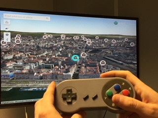
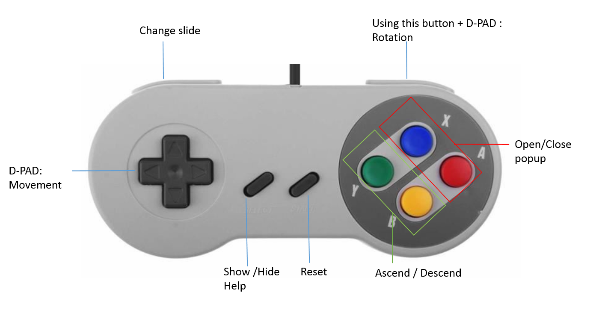

# Gamepad Sample

This is an experimental application to test the effectiveness of using a    [SNES USB Gamepad contoller for PC / RetroPi](https://en.wikipedia.org/wiki/Super_Nintendo_Entertainment_System) to navigate in a 3d web application built using [Esri](https://www.esri.com)'s [ArcGIS API for JavaScript](https://developers.arcgis.com/javascript/).

Click [here](https://sjguirim.github.io/Esri-Gamepad/) to test the application. 

This app has only been tested on Windows desktops with USB  game controller such as [this](https://github.com/RetroPie/RetroPie-Setup/wiki/Controller-Configuration).

The application was built using the following technologies:
- [ArcGIS API for JavaScript](https://developers.arcgis.com/javascript/) by [Esri](https://www.esri.com)
- [Bootstrap](https://getbootstrap.com/) by [Twitter Inc](https://twitter.com/)
- [jQuery](https://jquery.com/) by the jQuery Foundation Inc.
- [Open Iconic](https://github.com/cowboy/jquery-throttle-debounce/) by [Iconic](https://github.com/cowboy)
- [Popper.js](https://github.com/jquery/jquery-mousewheel/) by [Federico Zivolo](https://github.com/FezVrasta).

[This](https://www.arcgis.com/home/item.html?id=861e35bd6818445082796c1517454048) web scene of  Lyon city is used. To use an alternative scene, use a *webscene* query to specify the id of the alternative scene. For example:
https://sjguirim.github.io/Esri-Gamepad/index.html?webscene=9b6046a675fb4f70bd233d847988393e

Controls:

- D-PAD : Pan
- RIGHT SHOULDER + D-PAD : Rotation
- LEFT SHOULDER : Change slide 
- SELECT: Show /Hide help 
- START : Reset 
- B: Descend  
- Y: Ascend 
- A: Open popup
- X: Close popup 

This is a fork project, click [here](https://github.com/richiecarmichael/Esri-Gamepad) for the source application using Xbox controller.
